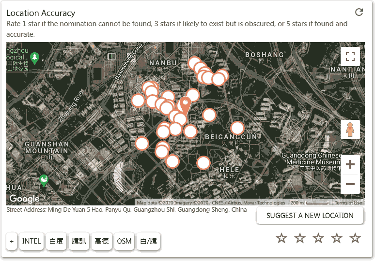
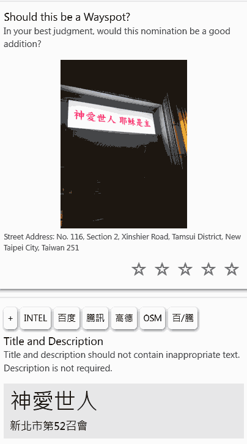
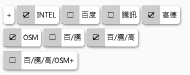
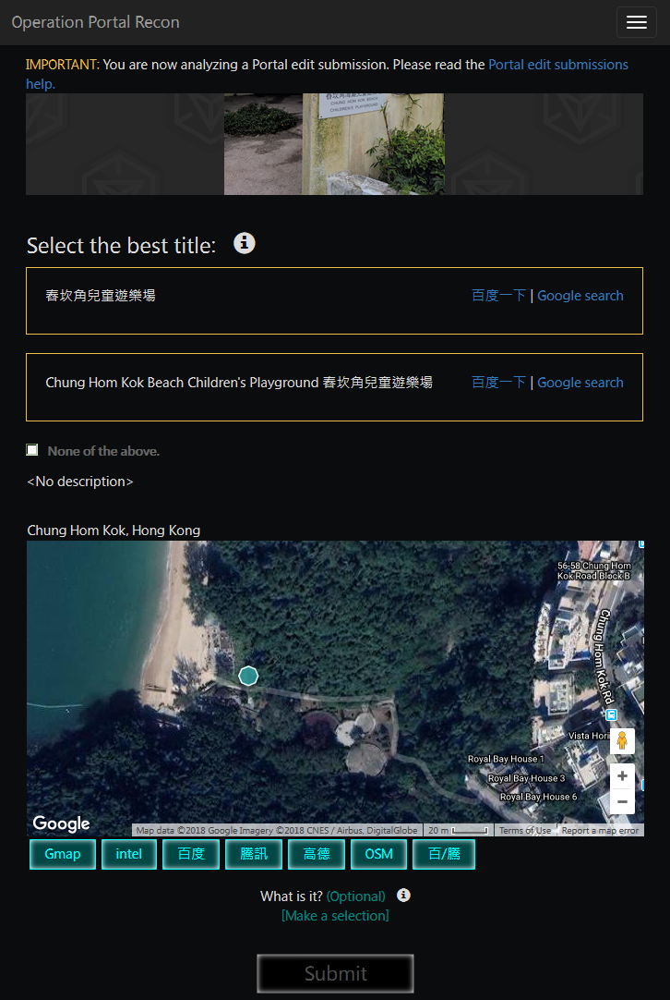
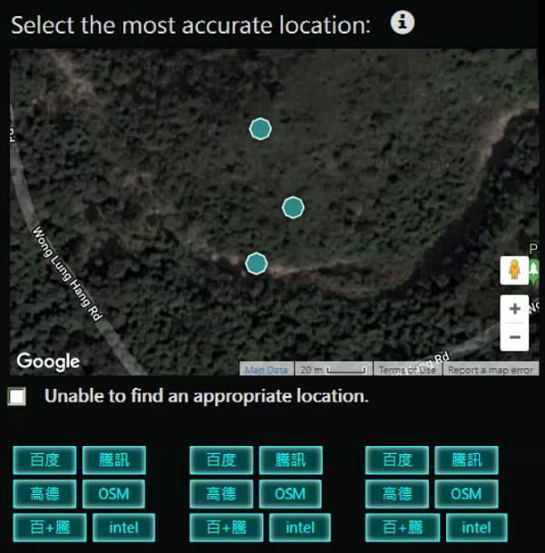
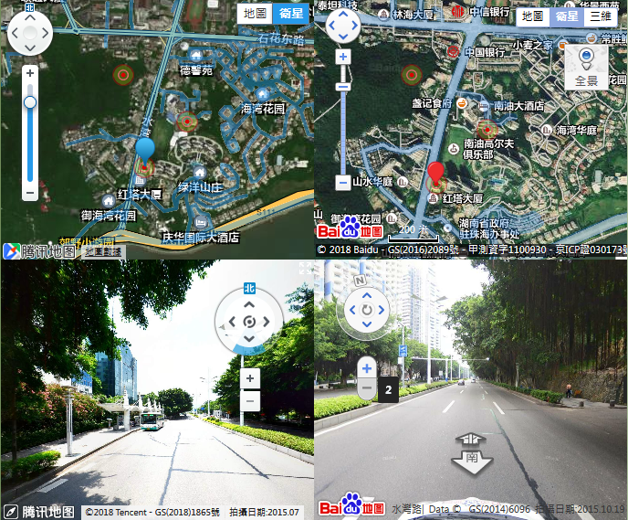

# OPR中国地图工具 / OPR China Map Helper 

连到各种地图，包括百度、腾讯、高德等。 
支持审核 "edit"，支持多个地点同时查询。 
Provides links to other maps, especially for maps useful in China. 
Supports multiple locations in "edit". 

#### script url: https://github.com/Ingrass/OPR-Tools/raw/master/Scripts/OPR_China_Map_Helper.user.js

# 書籤小程式 bookmarklet (iOS Safari/Android Chrome等 可使用)
執行內容是載入上述 script

`
javascript:(function(F,i,r,e,k,u,I,E){if(F.getElementById(k))return;E=F[i+'NS']&&F.documentElement.namespaceURI;E=E?F[i+'NS'](E,'script'):F[i]('script');E[r]('id',k);E[r]('src',I);E[r](k,u);(F[e]('head')[0]||F[e]('body')[0]).appendChild(E);})(document,'createElement','setAttribute','getElementsByTagName','MyScript','4','https://cdn.jsdelivr.net/gh/Ingrass/OPR-Tools/Scripts/OPR_China_Map_Helper.user.js?'+Math.floor(Date.now()/100000000));
`

#### 安裝方法可參考:
- https://sspai.com/post/26196
- https://kknews.cc/tech/69p22kl.html

#### Android上如何用 userscript
https://telegra.ph/Android上如何用-userscript-07-12

---

